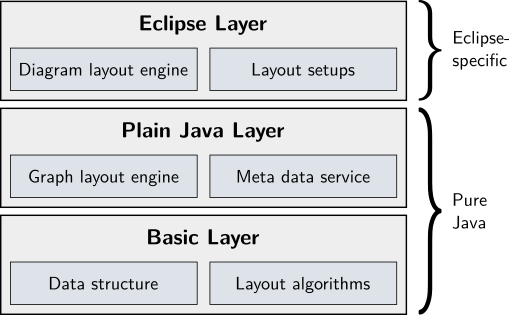

This section of the documentation is meant for tool developers who simply want to add automatic layout capabilities to their tool. Despite of its name, the Eclipse Layout Kernel is not limited to Eclipse-based applications, but can also be used in pure Java applications and even in JavaScript applications (although this is not yet available in ELK itself).

# Three Layers of Layout Goodness

At its basic, ELK is structured in three layers, each adding more convenience functionality to lower layers:

The rest of this page tries to give you an idea of what each layer contains and when you would want to use it.

## Basic Layer

> **Use Cases:**

> * People who only want a data structure to represent graphs.
> * People who want to use a single layout algorithm on flat graphs in a plain Java application.
> * Actually... Use the plain Java layer.

The basic layer contains the basic core functionality of the Eclipse Layout Kernel:

1. The KGraph data structure. This is the data structure used by ELK to describe the graphs to compute layouts for, complete with nodes, edges, ports, and labels. Each graph element can be annotated with layout properties that influence the way the graph is laid out. Also, each graph element can be annotated with miscellaneous data that we don't care about, but you might.

1. Layout algorithms. This is what you came here for. Our layout algorithms are implemented on top of our graph data structure, and are pure Java implementations. These algorithms can be invoked directly, even though most applications won't want to do so.

All of this is pure Java code, and the only library dependencies here are the _Eclipse Modeling Framework_ (which also works in pure Java applications without Eclipse) and _Google Guava_. Layout configuration is done by annotating graph elements with layout properties, nothing else. All that other configuration magic is added by the upper layers.

## Plain Java Layer

> **Use Cases:**

> * People who want to use automatic layout in a Java application that is not built on Eclipse.

The plan Java layer mostly adds functionality to execute layout algorithms more easily:

1. The layout meta data service. This is where all available layout algorithms and layout properties are registered, to be queried later. The registration is either done manually (pure Java applications) or automatically (through Eclipse extension points).

1. A robust recursive graph layout engine. Given a KGraph, the recursive graph layout engine provides a more convenient entry point to graph layout by abstracting away from the concrete layout algorithm to be used. In theory, you are free to provide your own, custom graph layout engine, or to call layout algorithms directly. However, building upon the layout meta data service, the recursive graph layout engine knows how to handle the messy details of running automatic layout on graphs. In particular, it supports _hierarchy_: graphs where nodes can contain graphs themselves.

Just like the basic layer, this is pure Java code and completely independent of Eclipse.

## Eclipse Layer

> **Use Cases:**

> * People who want to integrate automatic layout into their Eclipse-based application.

The Eclipse layer integrates automatic layout with Eclipse:

1. Layout setups. A layout setup provides the connection between a given editor or graph model and the layout kernel. This basically tells ELK, "if the user invokes layout on my editor, here's how to obtain the graph to be laid out, and this is how it should be configured; now go and do your magic!"

1. Diagram layout engine. Just like the graph layout engine provided an easy entry point to automatic layout on a KGraph, diagram layout engines provide an easy entry point to automatic layout given... well, _something you want laid out_, pretty much. The diagram layout engines uses the registered layout setups to find out if any of them knows how to turn that _something_ into a KGraph and run automatic layout on it. This is the highest-level abstraction ELK provides.

The advanced layer is where Eclipse dependencies come in. Everything in here is highly customisable through dependency injection.
