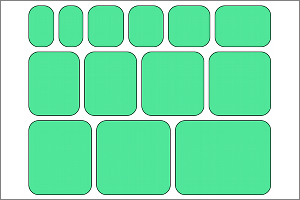

org.eclipse.elk.box

Algorithm for packing of unconnected boxes, i.e. graphs without edges.

## Preview

## Meta Data Provider
core.options.CoreOptions

## Supported Options

Option | regular default | algorithm default
----|----|----
[Node Spacing](org-eclipse-elk-spacing-node) | org.eclipse.xtext.xbase.impl.XNumberLiteralImpl@40aac05d (value: 20) | org.eclipse.xtext.xbase.impl.XNumberLiteralImpl@3537b0dc (value: 15)
[Border Spacing](org-eclipse-elk-spacing-border) | org.eclipse.xtext.xbase.impl.XNumberLiteralImpl@19dc50f3 (value: 12) | org.eclipse.xtext.xbase.impl.XNumberLiteralImpl@61d1cd63 (value: 15)
[Priority](org-eclipse-elk-priority) |  | org.eclipse.xtext.xbase.impl.XNumberLiteralImpl@60abe930 (value: 0)
[Expand Nodes](org-eclipse-elk-expandNodes) | org.eclipse.xtext.xbase.impl.XBooleanLiteralImpl@41003b9c (isTrue: false) | 
[Node Size Constraints](org-eclipse-elk-nodeSize-constraints) | <XFeatureCallImplCustom>.noneOf(<XFeatureCallImplCustom>) | 
[Node Size Options](org-eclipse-elk-nodeSize-options) | <XFeatureCallImplCustom>.of(<XMemberFeatureCallImplCustom>,<XMemberFeatureCallImplCustom>) | 
[Aspect Ratio](org-eclipse-elk-aspectRatio) |  | org.eclipse.xtext.xbase.impl.XNumberLiteralImpl@7fb8b5e3 (value: 1.3f)
[Interactive](org-eclipse-elk-interactive) | org.eclipse.xtext.xbase.impl.XBooleanLiteralImpl@e83e9a9 (isTrue: false) | 
[Node Size Minimum](org-eclipse-elk-nodeSize-minimum) |  | 
[Minimum Width](org-eclipse-elk-nodeSize-minWidth) | org.eclipse.xtext.xbase.impl.XNumberLiteralImpl@45f5326a (value: 0) | 
[Minimum Height](org-eclipse-elk-nodeSize-minHeight) | org.eclipse.xtext.xbase.impl.XNumberLiteralImpl@3bede4f9 (value: 0) | 
[Box Layout Mode](org-eclipse-elk-box-packingMode) | <XFeatureCallImplCustom>.SIMPLE | 

