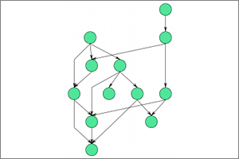

org.eclipse.elk.conn.gmf.layouter.Draw2D

'Directed Graph Layout' provided by the Draw2D framework. This is the same algorithm that is used by the standard layout button of GMF diagrams.

## Preview

## Meta Data Provider
GmfMetaDataProvider

## Supported Graph Features
MULTI_EDGES

## Category
### Layered
The layer-based method was introduced by Sugiyama, Tagawa and Toda in 1981. It emphasizes the direction of edges by pointing as many edges as possible into the same direction. The nodes are arranged in layers, which are sometimes called "hierarchies", and then reordered such that the number of edge crossings is minimized. Afterwards, concrete coordinates are computed for the nodes and edge bend points.

## Supported Options

Option | regular default | algorithm default
----|----|----
[Node Spacing](org-eclipse-elk-spacing-node) | org.eclipse.xtext.xbase.impl.XNumberLiteralImpl@1430c855 (value: 20) | org.eclipse.xtext.xbase.impl.XNumberLiteralImpl@53c39dc8 (value: 16)
[Border Spacing](org-eclipse-elk-spacing-border) | org.eclipse.xtext.xbase.impl.XNumberLiteralImpl@3144577e (value: 12) | org.eclipse.xtext.xbase.impl.XNumberLiteralImpl@11cb667e (value: 16)
[Direction](org-eclipse-elk-direction) | <XFeatureCallImplCustom>.UNDEFINED | <XFeatureCallImplCustom>.RIGHT
[Node Size Constraints](org-eclipse-elk-nodeSize-constraints) | <XFeatureCallImplCustom>.noneOf(<XFeatureCallImplCustom>) | 

