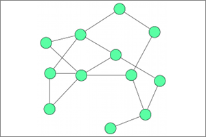

**Identifier:** org.eclipse.elk.force
**Meta Data Provider:** properties.ForceMetaDataProvider

Force-based algorithm provided by the Eclipse Layout Kernel. Implements methods that follow physical analogies by simulating forces that move the nodes into a balanced distribution. Currently the original Eades model and the Fruchterman - Reingold model are supported.

### Preview

## Category: Force
Layout algorithms that follow physical analogies by simulating a system of attractive and repulsive forces. The first successful method of this kind was proposed by Eades in 1984.

## Supported Graph Features
MULTI_EDGES
EDGE_LABELS

## Supported Options

Option | Type | Default Value | Identifier
----|----|----
[Priority](org-eclipse-elk-priority) | int |  1 | org.eclipse.elk.priority
[Node Spacing](org-eclipse-elk-spacing-nodeNode) | double |  80 | org.eclipse.elk.spacing.nodeNode
[Edge Label Spacing](org-eclipse-elk-spacing-edgeLabel) | double |  5 | org.eclipse.elk.spacing.edgeLabel
[Aspect Ratio](org-eclipse-elk-aspectRatio) | double |  1.6f | org.eclipse.elk.aspectRatio
[Randomization Seed](org-eclipse-elk-randomSeed) | int |  1 | org.eclipse.elk.randomSeed
[Separate Connected Components](org-eclipse-elk-separateConnectedComponents) | boolean |  true | org.eclipse.elk.separateConnectedComponents
[Padding](org-eclipse-elk-padding) | ElkPadding |  new ElkPadding(50) | org.eclipse.elk.padding
[Interactive](org-eclipse-elk-interactive) | boolean | *not defined* | org.eclipse.elk.interactive
[Port Constraints](org-eclipse-elk-portConstraints) | PortConstraints | *not defined* | org.eclipse.elk.portConstraints
[Force Model](org-eclipse-elk-force-model) | ForceModelStrategy | *not defined* | org.eclipse.elk.force.model
[FR Temperature](org-eclipse-elk-force-temperature) | double | *not defined* | org.eclipse.elk.force.temperature
[Iterations](org-eclipse-elk-force-iterations) | int | *not defined* | org.eclipse.elk.force.iterations
[Eades Repulsion](org-eclipse-elk-force-repulsion) | double | *not defined* | org.eclipse.elk.force.repulsion
[Repulsive Power](org-eclipse-elk-force-repulsivePower) | int | *not defined* | org.eclipse.elk.force.repulsivePower

