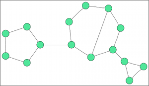

org.eclipse.elk.graphviz.circo

Circular layout, after Six and Tollis '99, Kaufmann and Wiese '02. The algorithm finds biconnected components and arranges each component in a circle, trying to minimize the number of crossings inside the circle. This is suitable for certain diagrams of multiple cyclic structures such as certain telecommunications networks.

## Preview

## Meta Data Provider
layouter.GraphvizMetaDataProvider

## Supported Graph Features
SELF_LOOPS
MULTI_EDGES
EDGE_LABELS

## Category
### Circle
Circular layout algorithms emphasize cycles or biconnected components of a graph by arranging them in circles. This is useful if a drawing is desired where such components are clearly grouped, or where cycles are shown as prominent OPTIONS of the graph.

## Supported Options

Option | regular default | algorithm default
----|----|----
[Node Spacing](org-eclipse-elk-spacing-node) | org.eclipse.xtext.xbase.impl.XNumberLiteralImpl@643fe6d1 (value: 20) | org.eclipse.xtext.xbase.impl.XNumberLiteralImpl@44fbcbc4 (value: 40)
[Border Spacing](org-eclipse-elk-spacing-border) | org.eclipse.xtext.xbase.impl.XNumberLiteralImpl@44a24c7d (value: 12) | org.eclipse.xtext.xbase.impl.XNumberLiteralImpl@6da6e5f4 (value: 10)
[Label Spacing](org-eclipse-elk-spacing-label) | org.eclipse.xtext.xbase.impl.XNumberLiteralImpl@62be5539 (value: 0) | 
[Node Size Constraints](org-eclipse-elk-nodeSize-constraints) | <XFeatureCallImplCustom>.noneOf(<XFeatureCallImplCustom>) | 
[Node Size Options](org-eclipse-elk-nodeSize-options) | <XFeatureCallImplCustom>.of(<XMemberFeatureCallImplCustom>,<XMemberFeatureCallImplCustom>) | 
[Edge Routing](org-eclipse-elk-edgeRouting) | <XFeatureCallImplCustom>.UNDEFINED | <XFeatureCallImplCustom>.SPLINES
[Debug Mode](org-eclipse-elk-debugMode) | org.eclipse.xtext.xbase.impl.XBooleanLiteralImpl@37404760 (isTrue: false) | 
[Separate Connected Components](org-eclipse-elk-separateConnectedComponents) |  | org.eclipse.xtext.xbase.impl.XBooleanLiteralImpl@34a49c1 (isTrue: false)
[Concentrate Edges](org-eclipse-elk-graphviz-concentrate) | org.eclipse.xtext.xbase.impl.XBooleanLiteralImpl@3b03098a (isTrue: false) | 
[Label Distance](org-eclipse-elk-graphviz-labelDistance) | org.eclipse.xtext.xbase.impl.XNumberLiteralImpl@7b999246 (value: 1) | 
[Label Angle](org-eclipse-elk-graphviz-labelAngle) | - <XNumberLiteralImpl> | 
[Overlap Removal](org-eclipse-elk-graphviz-overlapMode) | <XFeatureCallImplCustom>.PRISM | 
[Adapt Port Positions](org-eclipse-elk-graphviz-adaptPortPositions) | org.eclipse.xtext.xbase.impl.XBooleanLiteralImpl@7a548cd6 (isTrue: true) | 

