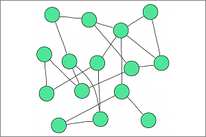

## FDP

**Identifier:** org.eclipse.elk.graphviz.fdp
**Meta Data Provider:** layouter.GraphvizMetaDataProvider

Spring model layouts similar to those of Neato, but does this by reducing forces rather than working with energy. Fdp implements the Fruchterman-Reingold heuristic including a multigrid solver that handles larger graphs and clustered undirected graphs.

## Category: Force
Layout algorithms that follow physical analogies by simulating a system of attractive and repulsive forces. The first successful method of this kind was proposed by Eades in 1984.

## Supported Graph Features

Name | Description
----|----
Self Loops | Edges connecting a node with itself.
Multi Edges | Multiple edges with the same source and target node.
Edge Labels | Labels that are associated with edges.
Clusters | Edges that connect nodes from different clusters, but not the cluster parent nodes.

## Supported Options

Option | Type | Default Value | Identifier
----|----|----
[Adapt Port Positions](org-eclipse-elk-graphviz-adaptPortPositions) | `boolean` | `true` | org.eclipse.elk.graphviz.adaptPortPositions
[Concentrate Edges](org-eclipse-elk-graphviz-concentrate) | `boolean` | `false` | org.eclipse.elk.graphviz.concentrate
[Debug Mode](org-eclipse-elk-debugMode) | `boolean` | `false` | org.eclipse.elk.debugMode
[Edge Label Spacing](org-eclipse-elk-spacing-edgeLabel) | `double` | `5` | org.eclipse.elk.spacing.edgeLabel
[Edge Routing](org-eclipse-elk-edgeRouting) | `EdgeRouting` | `EdgeRouting.SPLINES` | org.eclipse.elk.edgeRouting
[Interactive](org-eclipse-elk-interactive) | `boolean` | `false` | org.eclipse.elk.interactive
[Label Angle](org-eclipse-elk-graphviz-labelAngle) | `double` | `-25` | org.eclipse.elk.graphviz.labelAngle
[Label Distance](org-eclipse-elk-graphviz-labelDistance) | `double` | `1` | org.eclipse.elk.graphviz.labelDistance
[Max. Iterations](org-eclipse-elk-graphviz-maxiter) | `int` | `600` | org.eclipse.elk.graphviz.maxiter
[Node Size Constraints](org-eclipse-elk-nodeSize-constraints) | `EnumSet<SizeConstraint>` | `EnumSet.noneOf(SizeConstraint)` | org.eclipse.elk.nodeSize.constraints
[Node Size Options](org-eclipse-elk-nodeSize-options) | `EnumSet<SizeOptions>` | `EnumSet.of(SizeOptions.DEFAULT_MINIMUM_SIZE, SizeOptions.APPLY_ADDITIONAL_PADDING)` | org.eclipse.elk.nodeSize.options
[Node Spacing](org-eclipse-elk-spacing-nodeNode) | `double` | `40` | org.eclipse.elk.spacing.nodeNode
[Overlap Removal](org-eclipse-elk-graphviz-overlapMode) | `OverlapMode` | `OverlapMode.PRISM` | org.eclipse.elk.graphviz.overlapMode
[Padding](org-eclipse-elk-padding) | `ElkPadding` | `new ElkPadding(10)` | org.eclipse.elk.padding
[Separate Connected Components](org-eclipse-elk-separateConnectedComponents) | `boolean` | `false` | org.eclipse.elk.separateConnectedComponents

