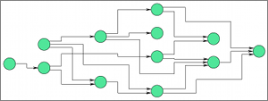

org.eclipse.elk.layered

## Preview

## Supported Options

Option | regular default | algorithm default 
----|----
org.eclipse.elk.spacing.node | org.eclipse.xtext.xbase.impl.XNumberLiteralImpl@4629253b (value: 20) | org.eclipse.xtext.xbase.impl.XNumberLiteralImpl@49803620 (value: 20)
org.eclipse.elk.spacing.border | org.eclipse.xtext.xbase.impl.XNumberLiteralImpl@13f1b603 (value: 12) | org.eclipse.xtext.xbase.impl.XNumberLiteralImpl@48b1677e (value: 12)
org.eclipse.elk.spacing.port | org.eclipse.xtext.xbase.impl.XNumberLiteralImpl@351a763f (value: 10) | null
org.eclipse.elk.spacing.label | org.eclipse.xtext.xbase.impl.XNumberLiteralImpl@607f371d (value: 0) | null
org.eclipse.elk.priority | null | org.eclipse.xtext.xbase.impl.XNumberLiteralImpl@245a142d (value: 0)
org.eclipse.elk.edgeRouting | <XFeatureCallImplCustom>.UNDEFINED | <XFeatureCallImplCustom>.ORTHOGONAL
org.eclipse.elk.port.borderOffset | null | org.eclipse.xtext.xbase.impl.XNumberLiteralImpl@2cad3dd6 (value: 0)
org.eclipse.elk.randomSeed | null | org.eclipse.xtext.xbase.impl.XNumberLiteralImpl@7b635617 (value: 1)
org.eclipse.elk.aspectRatio | null | org.eclipse.xtext.xbase.impl.XNumberLiteralImpl@287c3238 (value: 1.6f)
org.eclipse.elk.noLayout | org.eclipse.xtext.xbase.impl.XBooleanLiteralImpl@5328e61 (isTrue: false) | null
org.eclipse.elk.portConstraints | <XFeatureCallImplCustom>.UNDEFINED | null
org.eclipse.elk.port.side | <XFeatureCallImplCustom>.UNDEFINED | null
org.eclipse.elk.debugMode | org.eclipse.xtext.xbase.impl.XBooleanLiteralImpl@4382623e (isTrue: false) | null
org.eclipse.elk.alignment | <XFeatureCallImplCustom>.AUTOMATIC | null
org.eclipse.elk.layoutHierarchy | org.eclipse.xtext.xbase.impl.XBooleanLiteralImpl@61b500a8 (isTrue: false) | null
org.eclipse.elk.hierarchyHandling | <XFeatureCallImplCustom>.INHERIT | null
org.eclipse.elk.separateConnectedComponents | null | org.eclipse.xtext.xbase.impl.XBooleanLiteralImpl@7725fcd4 (isTrue: true)
org.eclipse.elk.insideSelfLoops.activate | org.eclipse.xtext.xbase.impl.XBooleanLiteralImpl@34f05ac (isTrue: false) | null
org.eclipse.elk.insideSelfLoops.yo | org.eclipse.xtext.xbase.impl.XBooleanLiteralImpl@5216d4cc (isTrue: false) | null
org.eclipse.elk.nodeSize.constraints | <XFeatureCallImplCustom>.noneOf(<XFeatureCallImplCustom>) | null
org.eclipse.elk.nodeSize.options | <XFeatureCallImplCustom>.of(<XMemberFeatureCallImplCustom>,<XMemberFeatureCallImplCustom>) | null
org.eclipse.elk.direction | <XFeatureCallImplCustom>.UNDEFINED | <XFeatureCallImplCustom>.UNDEFINED
org.eclipse.elk.nodeLabels.placement | <XFeatureCallImplCustom>.fixed | null
org.eclipse.elk.portLabels.placement | <XFeatureCallImplCustom>.OUTSIDE | null
org.eclipse.elk.portAlignment.basic | <XFeatureCallImplCustom>.JUSTIFIED | <XFeatureCallImplCustom>.JUSTIFIED
org.eclipse.elk.portAlignment.north | <XFeatureCallImplCustom>.UNDEFINED | null
org.eclipse.elk.portAlignment.south | <XFeatureCallImplCustom>.UNDEFINED | null
org.eclipse.elk.portAlignment.west | <XFeatureCallImplCustom>.UNDEFINED | null
org.eclipse.elk.portAlignment.east | <XFeatureCallImplCustom>.UNDEFINED | null
org.eclipse.elk.layered.spacing.edgeNodeSpacingFactor | org.eclipse.xtext.xbase.impl.XNumberLiteralImpl@4688ab3e (value: 0.5f) | null
org.eclipse.elk.layered.spacing.edgeSpacingFactor | org.eclipse.xtext.xbase.impl.XNumberLiteralImpl@292ae52a (value: 0.5f) | null
org.eclipse.elk.layered.unnecessaryBendpoints | org.eclipse.xtext.xbase.impl.XBooleanLiteralImpl@1e9157d5 (isTrue: false) | null
org.eclipse.elk.layered.layering.strategy | <XFeatureCallImplCustom>.NETWORK_SIMPLEX | null
org.eclipse.elk.layered.layering.nodePromotion.strategy | <XFeatureCallImplCustom>.NONE | null
org.eclipse.elk.layered.thoroughness | org.eclipse.xtext.xbase.impl.XNumberLiteralImpl@681ccf74 (value: 7) | null
org.eclipse.elk.layered.layering.layerConstraint | <XFeatureCallImplCustom>.NONE | null
org.eclipse.elk.layered.cycleBreaking.strategy | <XFeatureCallImplCustom>.GREEDY | null
org.eclipse.elk.layered.crossingMinimization.strategy | <XFeatureCallImplCustom>.LAYER_SWEEP | null
org.eclipse.elk.layered.crossingMinimization.greedySwitch | <XFeatureCallImplCustom>.TWO_SIDED | null
org.eclipse.elk.layered.crossingMinimization.semiInteractive | org.eclipse.xtext.xbase.impl.XBooleanLiteralImpl@74ccb966 (isTrue: false) | null
org.eclipse.elk.layered.mergeEdges | org.eclipse.xtext.xbase.impl.XBooleanLiteralImpl@541d1b5b (isTrue: false) | null
org.eclipse.elk.layered.mergeHierarchyEdges | org.eclipse.xtext.xbase.impl.XBooleanLiteralImpl@57c856f4 (isTrue: true) | null
org.eclipse.elk.layered.interactiveReferencePoint | <XFeatureCallImplCustom>.CENTER | null
org.eclipse.elk.layered.nodePlacement.strategy | <XFeatureCallImplCustom>.BRANDES_KOEPF | null
org.eclipse.elk.layered.nodePlacement.bk.fixedAlignment | <XFeatureCallImplCustom>.NONE | null
org.eclipse.elk.layered.edgeLabelSideSelection | <XFeatureCallImplCustom>.ALWAYS_DOWN | null
org.eclipse.elk.layered.feedbackEdges | org.eclipse.xtext.xbase.impl.XBooleanLiteralImpl@6e119abe (isTrue: false) | null
org.eclipse.elk.layered.spacing.inLayerSpacingFactor | org.eclipse.xtext.xbase.impl.XNumberLiteralImpl@4912b12f (value: 1) | null
org.eclipse.elk.layered.layering.wideNodesOnMultipleLayers | <XFeatureCallImplCustom>.OFF | null
org.eclipse.elk.layered.nodePlacement.linearSegments.deflectionDampening | org.eclipse.xtext.xbase.impl.XNumberLiteralImpl@1f49c9e (value: 0.3f) | null
org.eclipse.elk.layered.edgeRouting.selfLoopPlacement | <XFeatureCallImplCustom>.NORTH_STACKED | null
org.eclipse.elk.layered.contentAlignment | <XFeatureCallImplCustom>.noneOf(<XFeatureCallImplCustom>) | null
org.eclipse.elk.layered.nodePlacement.bk.edgeStraightening | <XFeatureCallImplCustom>.IMPROVE_STRAIGHTNESS | null
org.eclipse.elk.layered.compaction.postCompaction.strategy | <XFeatureCallImplCustom>.NONE | null
org.eclipse.elk.layered.compaction.postCompaction.constraints | <XFeatureCallImplCustom>.SCANLINE | null
org.eclipse.elk.layered.compaction.connectedComponents | org.eclipse.xtext.xbase.impl.XBooleanLiteralImpl@56ac0982 (isTrue: false) | null
org.eclipse.elk.layered.highDegreeNodes.treatment | org.eclipse.xtext.xbase.impl.XBooleanLiteralImpl@5c5f0c2b (isTrue: false) | null
org.eclipse.elk.layered.highDegreeNodes.threshold | org.eclipse.xtext.xbase.impl.XNumberLiteralImpl@1ce7fd6 (value: 16) | null
org.eclipse.elk.layered.highDegreeNodes.treeHeight | org.eclipse.xtext.xbase.impl.XNumberLiteralImpl@bbfdeda (value: 5) | null
org.eclipse.elk.nodeSize.minimum | null | null
org.eclipse.elk.nodeSize.minWidth | org.eclipse.xtext.xbase.impl.XNumberLiteralImpl@302c13f6 (value: 0) | null
org.eclipse.elk.nodeSize.minHeight | org.eclipse.xtext.xbase.impl.XNumberLiteralImpl@78ba5665 (value: 0) | null
org.eclipse.elk.junctionPoints | null | null
org.eclipse.elk.edge.thickness | org.eclipse.xtext.xbase.impl.XNumberLiteralImpl@223763b3 (value: 1) | null
org.eclipse.elk.edgeLabels.placement | <XFeatureCallImplCustom>.UNDEFINED | null
org.eclipse.elk.port.index | null | null
org.eclipse.elk.commentBox | org.eclipse.xtext.xbase.impl.XBooleanLiteralImpl@20ab5ae9 (isTrue: false) | null
org.eclipse.elk.hypernode | org.eclipse.xtext.xbase.impl.XBooleanLiteralImpl@36937f57 (isTrue: false) | null
org.eclipse.elk.port.anchor | null | null
org.eclipse.elk.partitioning.activate | org.eclipse.xtext.xbase.impl.XBooleanLiteralImpl@7c1aeda4 (isTrue: false) | null
org.eclipse.elk.partitioning.partition | null | null
org.eclipse.elk.layered.layering.distributeNodes | org.eclipse.xtext.xbase.impl.XBooleanLiteralImpl@584b2468 (isTrue: false) | null
org.eclipse.elk.layered.layering.minWidth.upperBoundOnWidth | org.eclipse.xtext.xbase.impl.XNumberLiteralImpl@1d70ef0d (value: 4) | null
org.eclipse.elk.layered.layering.minWidth.upperLayerEstimationScalingFactor | org.eclipse.xtext.xbase.impl.XNumberLiteralImpl@61d07b49 (value: 2) | null
org.eclipse.elk.layered.sausageFolding | org.eclipse.xtext.xbase.impl.XBooleanLiteralImpl@6e015c1e (isTrue: false) | null
org.eclipse.elk.position | null | null
org.eclipse.elk.layered.northOrSouthPort | org.eclipse.xtext.xbase.impl.XBooleanLiteralImpl@39e2c6a5 (isTrue: false) | null
org.eclipse.elk.layered.layering.nodePromotion.maxIterations | org.eclipse.xtext.xbase.impl.XNumberLiteralImpl@59b01967 (value: 0) | null
org.eclipse.elk.layered.edgeCenterLabelPlacementStrategy | <XFeatureCallImplCustom>.CENTER | null
org.eclipse.elk.margins | org.eclipse.xtext.xbase.impl.XConstructorCallImplCustom@124fbf14 (invalidFeatureIssueCode: null, validFeature: false, explicitConstructorCall: false, anonymousClassConstructorCall: false) | null
org.eclipse.elk.layered.edgeRouting.sloppySplineRouting | org.eclipse.xtext.xbase.impl.XBooleanLiteralImpl@3234a0a9 (isTrue: true) | null
org.eclipse.elk.layered.edgeRouting.sloppySplineLayerSpacing | org.eclipse.xtext.xbase.impl.XNumberLiteralImpl@4d93ae13 (value: 0.4f) | null
org.eclipse.elk.layered.layering.coffmanGraham.layerBound | <XFeatureCallImplCustom>.MAX_VALUE | null

## Supported Graph Features
self_loops    SELF_LOOPS
inside_self_loops    INSIDE_SELF_LOOPS
multi_edges    MULTI_EDGES
edge_labels    EDGE_LABELS
ports    PORTS
compound    COMPOUND
clusters    CLUSTERS

