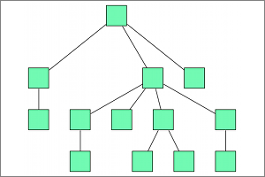

## ELK Mr. Tree

**Identifier:** org.eclipse.elk.mrtree
**Meta Data Provider:** properties.MrTreeMetaDataProvider

Tree-based algorithm provided by the Eclipse Layout Kernel. Computes a spanning tree of the input graph and arranges all nodes according to the resulting parent-children hierarchy. I pity the fool who doesn't use Mr. Tree Layout.

## Category: Tree
Specialized layout methods for trees, i.e. acyclic graphs. The regular structure of graphs that have no undirected cycles can be emphasized using an algorithm of this type.

## Supported Graph Features

Name | Description
----|----
Disconnected | Multiple connected components.

## Supported Options

Option | Type | Default Value | Identifier
----|----|----
[Aspect Ratio](org-eclipse-elk-aspectRatio) | `double` | `1.6f` | org.eclipse.elk.aspectRatio
[Debug Mode](org-eclipse-elk-debugMode) | `boolean` | `false` | org.eclipse.elk.debugMode
[Direction](org-eclipse-elk-direction) | `Direction` | `Direction.DOWN` | org.eclipse.elk.direction
[Node Spacing](org-eclipse-elk-spacing-nodeNode) | `double` | `20` | org.eclipse.elk.spacing.nodeNode
[Padding](org-eclipse-elk-padding) | `ElkPadding` | `new ElkPadding(20)` | org.eclipse.elk.padding
[Priority](org-eclipse-elk-priority) | `int` | `1` | org.eclipse.elk.priority
[Search Order](org-eclipse-elk-mrtree-searchOrder) | `TreeifyingOrder` | `TreeifyingOrder.DFS` | org.eclipse.elk.mrtree.searchOrder
[Separate Connected Components](org-eclipse-elk-separateConnectedComponents) | `boolean` | `true` | org.eclipse.elk.separateConnectedComponents
[Weighting of Nodes](org-eclipse-elk-mrtree-weighting) | `OrderWeighting` | `OrderWeighting.DESCENDANTS` | org.eclipse.elk.mrtree.weighting

