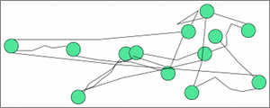

## Randomizer

**Identifier:** org.eclipse.elk.random
**Meta Data Provider:** core.options.CoreOptions

Distributes the nodes randomly on the plane, leading to very obfuscating layouts. Can be useful to demonstrate the power of "real" layout algorithms.

## Supported Options

Option | Type | Default Value | Identifier
----|----|----
[Aspect Ratio](org-eclipse-elk-aspectRatio) | `double` | `1.6f` | org.eclipse.elk.aspectRatio
[Node Spacing](org-eclipse-elk-spacing-nodeNode) | `double` | `15` | org.eclipse.elk.spacing.nodeNode
[Padding](org-eclipse-elk-padding) | `ElkPadding` | `new ElkPadding(15)` | org.eclipse.elk.padding
[Randomization Seed](org-eclipse-elk-randomSeed) | `int` | `0` | org.eclipse.elk.randomSeed

