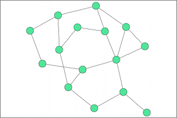

# Algorithms

### Dot

### Neato

### FDP

### Twopi

### Circo

# LegacyIds

label | id | legacyIds
----|----|----
Adapt Port Positions | org.eclipse.elk.graphviz.adaptPortPositions | 
Concentrate Edges | org.eclipse.elk.graphviz.concentrate | 
Epsilon | org.eclipse.elk.graphviz.epsilon | 
Iterations Factor | org.eclipse.elk.graphviz.iterationsFactor | 
Label Angle | org.eclipse.elk.graphviz.labelAngle | 
Label Distance | org.eclipse.elk.graphviz.labelDistance | 
Layer Spacing Factor | org.eclipse.elk.graphviz.layerSpacingFactor | 
Max. Iterations | org.eclipse.elk.graphviz.maxiter | 
Distance Model | org.eclipse.elk.graphviz.neatoModel | 
Overlap Removal | org.eclipse.elk.graphviz.overlapMode | 
